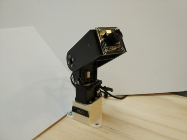
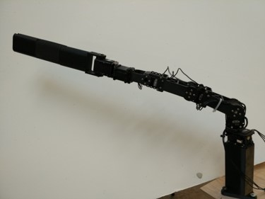
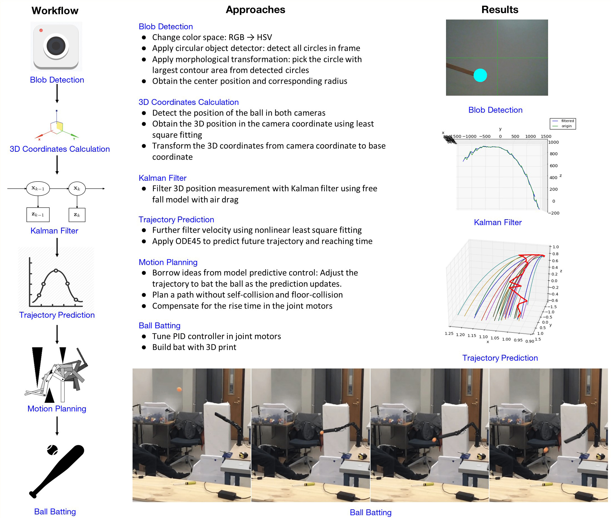

## Automatic Ball Tracking and Batting System

###### Dali Zhang, Shihao Feng, Tiancheng Ge, Zizhao Wang, Zeyu Zhang

###### University of Michigan, EECS 467 Autonomous Robotics W18, Final Project

In this project our team designed a robot that could track the ball, predict the movement and bat the ball in the end.

Ball detection:

Ball tracking:

  
   

Batting:

  
   

Structure

- Two cameras to detect the ball

- Two turntables to keep the cameras aiming at the ball

  

- A robot arm to bat the ball

  

